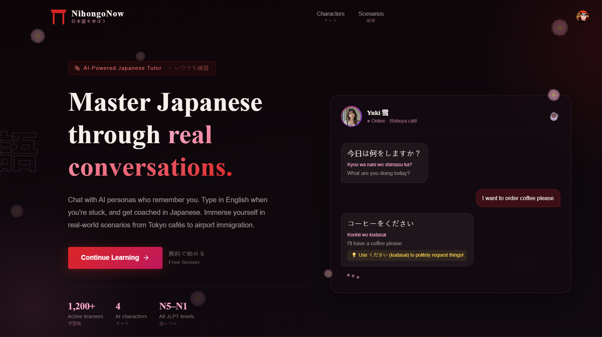
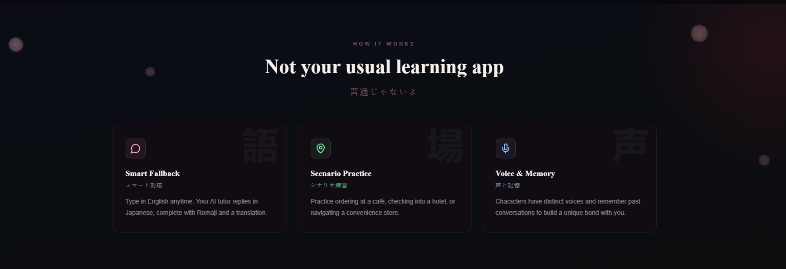
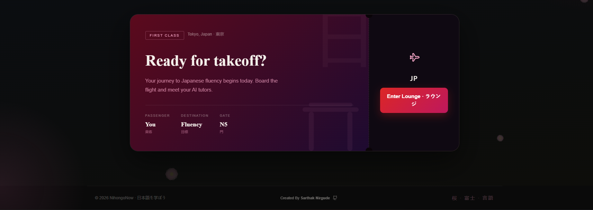
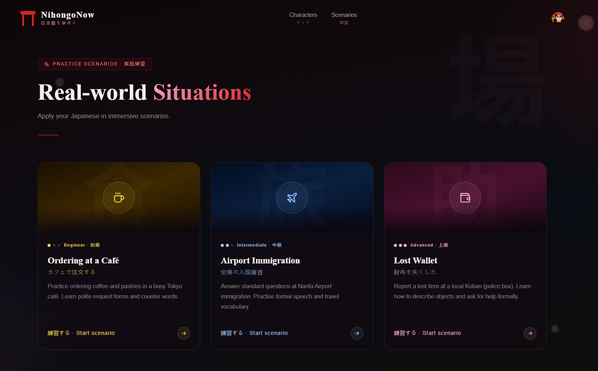
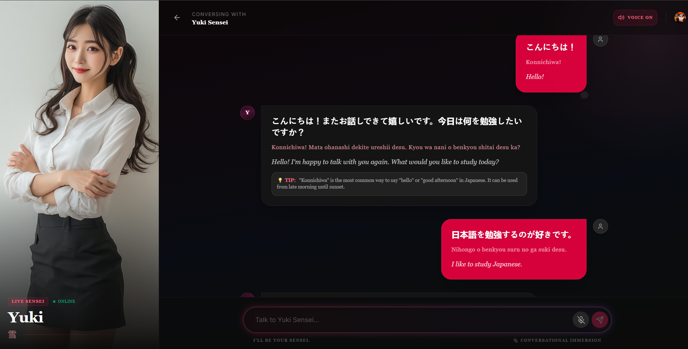

# 🏯 NihongoNow: Zen-Modern Japanese Immersion

NihongoNow is a high-fidelity, AI-powered language learning platform designed to provide an immersive Japanese conversational experience. Connect with unique AI Senseis, practice speaking in real-time, and master the language through authentic dialogue.


## 💎 Features

- **Immersive Conversational AI:** Practice with multiple characters like **Yuki**, **Sakura**, and **Takeshi**, each with unique personalities, speech patterns, and custom-tuned voices.
- **High-Fidelity "Zen-Modern" UI:** A premium user experience featuring glassmorphism, floating Sakura petals, and smooth framer-motion animations.
- **Bi-Directional Enrichment:** Every message you send is automatically translated and transliterated (Romaji) so you can see exactly how your thoughts sound in Japanese.
- **🎤 Voice-to-Text Integration:** Speak naturally using the built-in microphone support, optimized for Japanese and English recognition.
- **🔊 Smart Text-to-Speech:** Native-sounding Japanese audio responses with intelligent masculine/feminine voice fallbacks.
- **Scenario-Based Learning:** Practice in real-world situations like cafes, airports, or traditional tea ceremonies.

## 📸 Preview







## 🛠️ Tech Stack

- **Framework:** [Next.js 14](https://nextjs.org/) (App Router)
- **AI Engine:** [Google Gemini 1.5 Flash](https://aistudio.google.com/)
- **Database:** [MongoDB](https://www.mongodb.com/) with Mongoose
- **Auth:** [Clerk](https://clerk.com/)
- **Animations:** [Framer Motion](https://www.framer.com/motion/)
- **Styling:** Tailwind CSS + Vanilla CSS (Glassmorphism)
- **Icons:** [Lucide React](https://lucide.dev/)
- **Voice:** Web Speech API (SpeechRecognition & Synthesis)

## 🚀 Getting Started

### Prerequisites

- Node.js 18+ 
- A MongoDB Connection String
- A Google Gemini API Key
- Clerk API Keys

### Installation

1. **Clone the repository:**
   ```bash
   git clone https://github.com/Sarthak000001/nihongonow.git
   cd nihongonow
   ```

2. **Install dependencies:**
   ```bash
   npm install
   ```

3. **Set up Environment Variables:**
   Create a `.env.local` file in the root directory:
   ```env
   NEXT_PUBLIC_CLERK_PUBLISHABLE_KEY=your_clerk_pub_key
   CLERK_SECRET_KEY=your_clerk_secret_key
   MONGODB_URI=your_mongodb_uri
   GEMINI_API_KEY=your_gemini_api_key
   ```

4. **Run the development server:**
   ```bash
   npm run dev
   ```

Open [http://localhost:3000](http://localhost:3000) with your browser to see the result.

## 📂 Project Structure

- `src/app`: Next.js App Router pages and API routes.
- `src/components`: Shared UI components (Navigation, Decorations, etc.).
- `src/models`: Mongoose database schemas.
- `src/lib`: Utility functions and centralized constants.
- `public`: Static assets (images, logos).

## 🤝 Contributing

Contributions are welcome! Please feel free to submit a Pull Request.

## 📄 License

This project is licensed under the MIT License - see the [LICENSE](LICENSE) file for details.

## 👤 Author

**Sarthak Nirgude**
- GitHub: [@Sarthak000001](https://github.com/Sarthak000001)

---
*Made with ❤️ for Japanese learners everywhere.*
